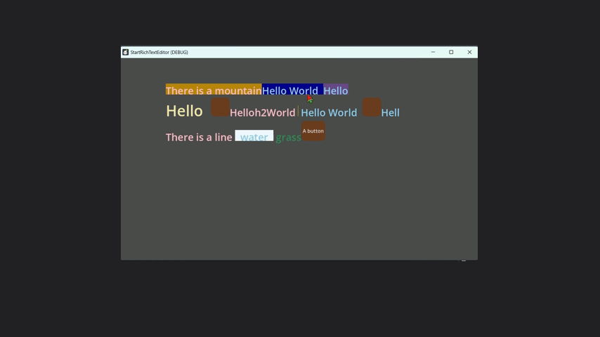
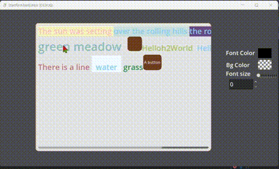
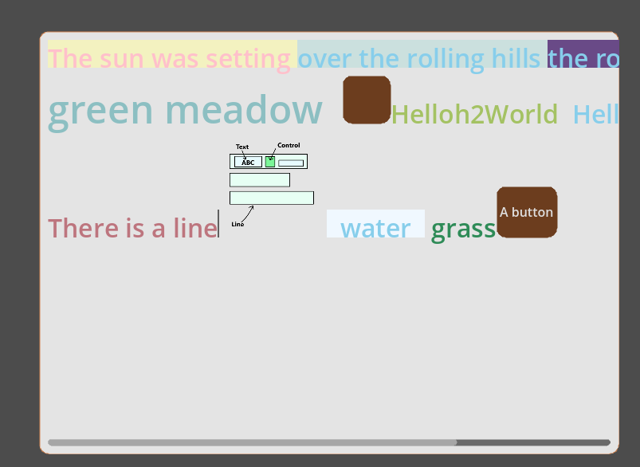
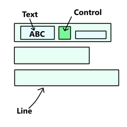

# StartRichTextEditor

Rich text editor for Godot







using  `TextLine` to draw text and `Control` to draw other(such as Image, Button, even a scene!!)

However, there are still many bugs (**not recommended for use in serious projects)**, so it’s better to learn from it, and then fix or extend it.

#### No finished:

* delete selection
* good copy&paste
* perfect caret move
* enough config
* undo&redo
* scroll(follow caret)
* easy plugin system
* easy interface
* clean code

#### Finished:

* set&move caret
* make selection
* simple copy&paste
* ime input support
* parse text
* simple inspector

### Usage

#### Start

* Add Node `RichTextEditor` (Dont't add other node to this node!!!) to your tree and run
* there is a example scene you can run:

  res://addons/start_rich_text_editor/example/MultiLineEditor.tscn
* Add Node `RichTextEditor`and extend the script

#### Basic

lines->line->{text,control}

control is a rect to place Control Node



#### Add init text

Use Array[Dictionary], if you want to add pure text, you can parse text to Array[Dictionary]

the dict is:

Text Block:

```c++
{
    "text":String
    "font_color":Color
    "bg_color":Color
    "font_size":int
}
```

Control Block:

```c++
{
    "key":String
    "size":Vector2
    "c":Control
}
```

A code example is in res://addons/start_rich_text_editor/example/rich_text_editor_1.gd(it is very useful~)

#### Add Control

You can use `add_control` or set 'c' in dict, and then add_child

To make [create and attach control] easier, you can make Factory to create control and set their prop, like that:

```lua
{key='btn1',size=Vector2(64,64),
type='button',
prop={
	text='button',
	color='#c0d470',
	bdc='#67835c',
	fc='#000000'
}}
```

```python
class ControlFactory:
	static var table={
		button=ButtonFactory,
		image=ImageFactory
		}
	static func create(type:String,props:Dictionary)->Control:
		return table[type].create(props)

	class ButtonFactory:
		static func create(props:Dictionary):
			var btn=Button.new()
			btn.text=props.get('text','')
			if props.has('color'):
				var stylebox=StyleBoxFlat.new()
				stylebox.bg_color=Color.from_string(props.color,Color.NAVAJO_WHITE)
				stylebox.set_corner_radius_all(12)
				stylebox.set_border_width_all(1)
				stylebox.border_color=Color.from_string(props.get('bdc',''),Color.NAVAJO_WHITE)
				btn.add_theme_color_override('font_color',Color.from_string(props.get('fc',''),Color.NAVAJO_WHITE))
				btn.add_theme_stylebox_override('normal',stylebox)
			return btn
```

#### Add parser

Each time when text change, a signal will be emitted to call parse

You can use Callable(line:PowerLineEdit) to set `default_parser` in MultilineEditor.

#### Application

* command line
* code edit
* chat box
* doc

---

## 中文

用于Godot4的富文本编辑器

用TextLine渲染文字和Control进行渲染控件（之后在控件里塞什么都行，图片，场景）

现在很多bugs，属于demo一类的完成度，所以最好从中学习和修改
